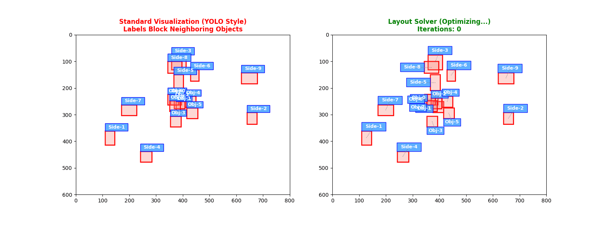

# LabelLayoutSolver

一个高性能、可配置的 2D 标签布局求解器，采用 C++ 编写并提供 Python 绑定。它旨在解决复杂的标注重叠问题，支持动态字体缩放、空间索引加速和启发式迭代优化。

## 🌓 布局效果展示及迭代过程


## 🚀 核心特性

*   **空间索引加速**：内置 `FlatUniformGrid`（均匀网格），在处理数百个标签时依然保持高性能。
*   **多策略候选生成**：支持在目标物体周边的多个位置（如 Top-Outer, Side 等）尝试布局。
*   **动态字体缩放**：当空间拥挤时，算法会自动尝试减小字号以寻找非重叠解。
*   **软约束代价系统**：基于代价函数（Cost Function）平衡标签位置偏好、目标遮挡、标签互斥等冲突。
*   **随机化迭代优化**：通过随机打乱顺序的局部搜索（Local Search）机制，有效避免局部最优。
*   **动态边缘采样**：基于物体边长自动计算滑动步长（Dynamic Steps），确保标签能精准钻入细小缝隙。

## 🛠 编译与安装

### 环境依赖
*   C++11 或更高版本的编译器
*   CMake (>= 3.15)
*   Python 3.x
*   [pybind11](https://github.com/pybind/pybind11) (`pip install pybind11`)

### pip 安装
```bash
pip install -e .
```

## 🐍 Python 使用示例

```python
import sys
import os
import layout_solver

def my_measure_func(text, font_size):
    # 这里可以使用 PIL.ImageFont 或 OpenCV 的 getTextSize
    # 返回: layout_solver.TextSize(width, height, baseline)
    estimated_width = len(text) * (font_size // 2)
    return layout_solver.TextSize(estimated_width, font_size, 2)

# 2. 配置求解器参数
config = layout_solver.LayoutConfig()
config.maxIterations = 25
config.costOverlapBase = 100000.0   # 标签重叠的高额惩罚
config.costScaleTier = 5000.0       # 鼓励在必要时缩小字体

# 3. 初始化求解器 (画布宽高: 1920x1080)
solver = layout_solver.LabelLayoutSolver(1920, 1080, my_measure_func, config)

# 4. 添加待布局的对象
# 参数: left, top, right, bottom, text, base_font_size
solver.add(100, 100, 200, 200, "Target_01", 16)
solver.add(150, 150, 250, 250, "Target_02", 16)

# 5. 执行布局计算
solver.solve()

# 6. 获取结果
results = solver.get_results()
for i, res in enumerate(results):
    print(f"Label {i}: pos=({res.x}, {res.y}), size={res.width}x{res.height}, font_size={res.fontSize}")
```

## ⚙️ 参数详解 (`LayoutConfig`)

| 属性 | 默认值 | 描述 |
| :--- | :--- | :--- |
| `costPos1_Top` | 0 | 优先级 1：物体正上方对齐 |
| `costPos2_Right` | 10 | 优先级 2：物体右侧对齐 |
| `costPos3_Bottom` | 20 | 标签之间相互重叠的代价权重。 |
| `costPos4_Left` | 30 | 优先级 4：物体左侧对齐 |
| `costSlidingPenalty` | 100 | 滑动基准惩罚。设为 100 确保优先尝试固定锚点，无解才滑动 |
| `maxIterations`| 30 | 迭代轮数。锚点增多后，建议设为 30-50 以获得更稳健的结果。 |
| `costScaleTier` | 10000 | 缩放惩罚。保持极大值可优先保证字号，实在放不下才缩小。 |
| `costOccludeObj` | 100000 | 遮挡物体的惩罚，保持极大值，一旦发生碰撞，成本会迅速超过滑动惩罚|
| `costOverlapBase` | 100000 | 标签间重叠的惩罚，保持极大值，一旦发生碰撞，成本会迅速超过滑动惩罚 |
| `paddingX / Y` | 2 | 标签文本周围预留的像素边距。 |

## 📐 算法原理

1.  **候选池生成**：为每个 Item 生成不同方位（Top/Bottom/Left/Right/Outer）以及不同缩放级别（1.0x, 0.9x, 0.8x, 0.75x）的候选框。
2.  **静态初始化**：首先计算候选框与所有已知“物体框”的遮挡关系，通过贪心策略选择一个静态冲突最少的位置。
3.  **迭代优化**：
    *   在每一轮迭代中，随机打乱标签的处理顺序。
    *   针对每个标签，通过空间索引查询与其发生重叠的其他标签。
    *   计算当前“动态代价”，并尝试在候选池中寻找能降低全局总代价（几何+静态+动态）的更好位置。
    *   当不再有位置变动或达到最大迭代次数时停止。

## 📄 许可证
[MIT License](LICENSE)